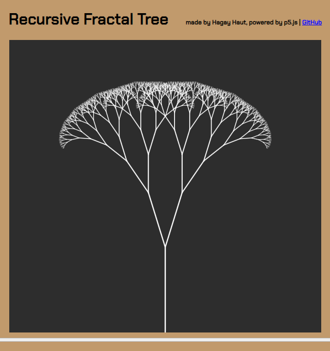
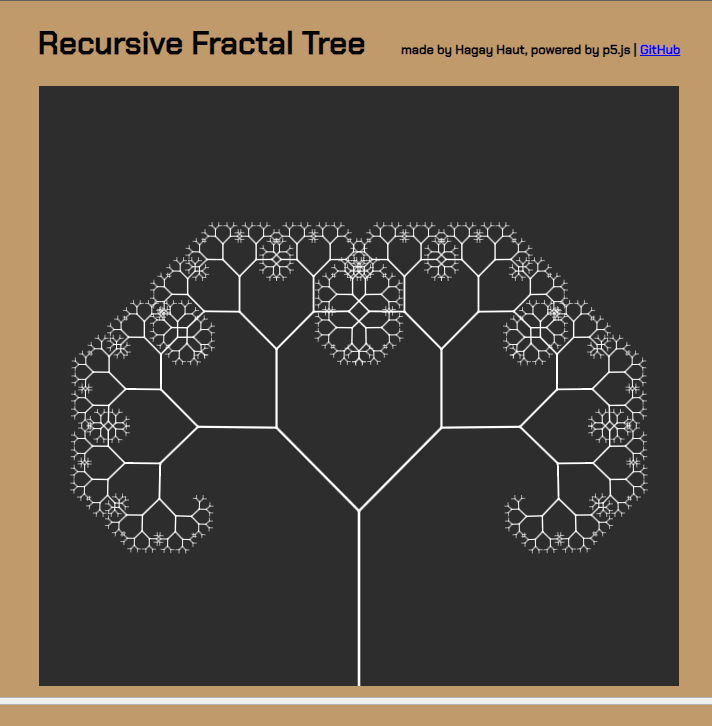
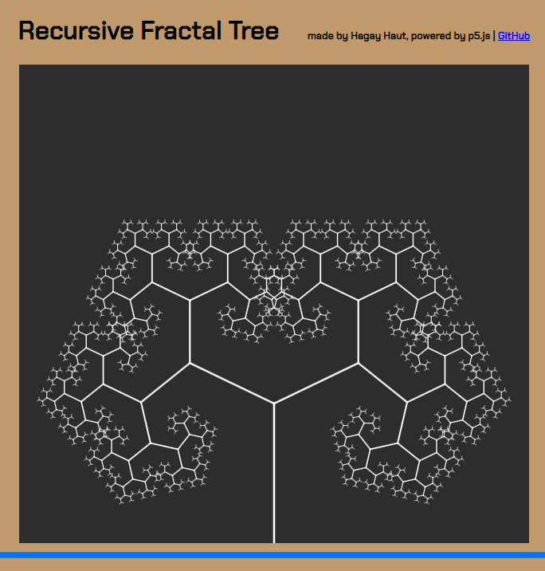
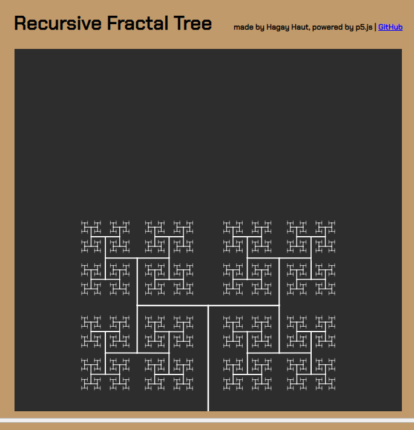
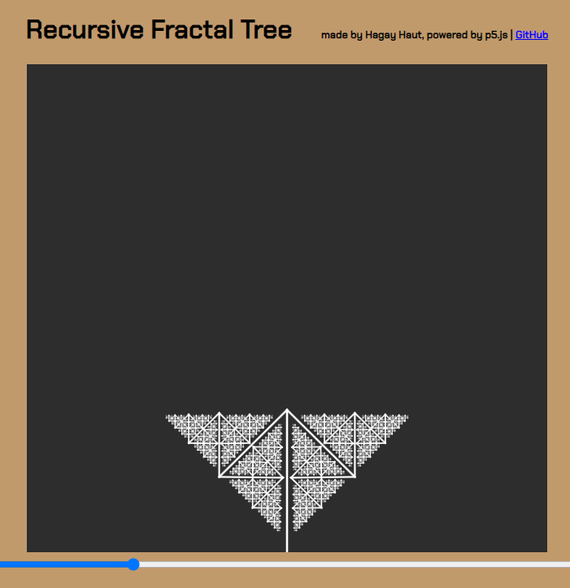

# Interactive Recursive Fractal Tree



This mini project was inspired and guided by [The Coding Train](https://www.youtube.com/channel/UCvjgXvBlbQiydffZU7m1_aw) YouTube channel. The p5 library was used for creating the canvas and translate the recursive function calls to lines on the screen. Try it out for yourself [here](https://hagayhaut.github.io/fractal-tree/). Move the slider and check out all the different trees just you can create!

## Whas's A Fractal Tree?

A fractal is a pattern which seems identical at different scales, and repeats itself inwards and outwards, infinitely. A fractal tree is just a fractal pattern that resembles a tree and its branches.

## Pseudo Fractal Tree

Since computers cannot compute fractals to infinity, these "fractal trees" are not true fractals, as their branches stop growing once they reach the length of 4 pixels. They are pseudo-fractal trees. Furthermore, the width of each branch is not a fraction of the length, but half the log of the length. I chose to use the log of the length so that the width is still visible at the tips, but also decreases with each iteration of the tree.

## Using Recursion 

Recursion is a great tool for working with fractals, because it is essentially the programmatic version of a fractal, with the important distinction that recursion is equipped with a base case to the end the recursive call. Check out the function doing the heavy lifting:

```javascript
function branch(len) {
  weight = Math.log(len) / 2
  strokeWeight(weight);
  line(0, 0, 0, -len);
  translate(0, -len);
  if (len > 4) {
    push();
    rotate(angle);
    branch(len * 0.67);
    pop();
    push();
    rotate(-angle);
    branch(len * 0.67)
    pop();
  }
}

```

## Some of my favorites: 





